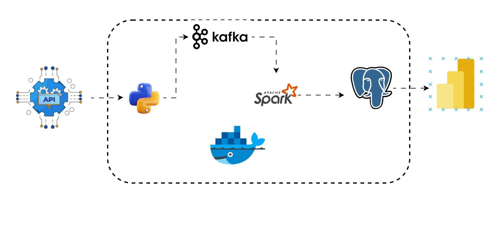
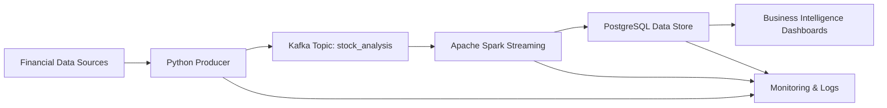

# Real-Time Financial Data Processing Platform

This project builds a real-time stock market data pipeline to improve the accuracy, timeliness, reliability, and visibility of financial insights. It collects market data from external sources, processes it instantly with event streaming, stores it in a scalable analytics database, and delivers near-real-time reporting through dashboards.

The objective is to provide faster, more reliable stock insights so clients can act on market signals with confidence.

**Status**: ✅ Production-Ready | **Deployment**: Containerized

---

## 📊 System Architecture



### Visual Overview



The platform uses an event-driven streaming stack to support low-latency financial analytics:

- **Data Ingestion**: Captures live financial feeds and external API data in real time
- **Stream Processing**: Apache Spark transforms and enriches market events with minimal delay
- **Event Transport**: Apache Kafka provides reliable, durable streaming with high throughput
- **Storage**: PostgreSQL holds time-series market data in a scalable, queryable schema
- **Monitoring**: Dashboards and logs provide visibility into data flow and system health
- **Reporting**: Analytical dashboards surface timely trading signals and performance metrics

---

## � Power BI Visualization

A key deliverable for this platform is real-time dashboarding in Power BI. The system is designed to support visualizations such as:

- Live price trend charts for individual securities
- Volume and liquidity heatmaps
- Aggregated momentum and volatility indicators
- Performance summary tables for portfolio decision support

Power BI can query the PostgreSQL store directly or consume cleaned output datasets exported from the pipeline, enabling business users to monitor market activity and act on insights immediately.

---

## �💼 Project Objective

The project is designed to:

- Improve data accuracy and timeliness for stock market insights
- Enable real-time reporting and operational decision support
- Increase system reliability through fault-tolerant streaming
- Reduce data latency and deliver fresh insights faster
- Improve monitoring and observability for production operations

---

## 🏗️ Key Architectural Highlights

- **Low Latency Processing**: Real-time ingestion and streaming processing minimize lag
- **High Reliability**: Persistent checkpointing and resilient services keep the pipeline stable
- **Scalable Architecture**: Kafka and Spark enable the system to handle growing data volume
- **Fast Analytics**: Index-optimized storage supports quick query response times
- **Containerized Deployment**: Docker Compose ensures consistent, repeatable environments
- **Operational Monitoring**: Integrated dashboards track availability, throughput, and latency
- **Clean Separation of Concerns**: Ingestion, streaming, persistence, and reporting are decoupled for easier scaling

---

## 🛠️ Technology Stack

| Component | Technology | Version | Rationale |
|-----------|-----------|---------|-----------|
| **API Integration** | RESTful Services | Production | Reliable external data acquisition |
| **Event Streaming** | Apache Kafka | 7.4.10 | Durable, scalable message brokerage with KRaft consensus |
| **Stream Processing** | Apache Spark | 3.5.1 | Distributed computing with Structured Streaming API |
| **Data Warehouse** | PostgreSQL | 17 | ACID compliance with advanced indexing capabilities |
| **Orchestration** | Docker & Compose | Latest | Container-native deployment and service management |
| **Runtime** | Python | 3.x | Rapid development with extensive data science ecosystem |
| **Administrative Tools** | pgAdmin 4 | 9 | Database administration and optimization |
| **System Monitoring** | Kafka UI | 0.7.2 | Topic management and message inspection |

---

## 📋 Prerequisites & Requirements

### Required Dependencies

- **Docker Engine** (v20.10+) - Container runtime environment
- **Docker Compose** (v2.0+) - Multi-container orchestration
- **Python** (v3.8+) - Runtime for data ingestion and processing utilities
- **Git** (latest) - Version control and repository management
- **Financial Data API Credentials** - [Alpha Vantage API Key](https://www.alphavantage.co/)

### Recommended System Specifications

- **Memory**: 8GB RAM (minimum 4GB)
- **Storage**: 10GB available disk space
- **Compute**: Multi-core processor (2+ cores recommended)
- **Network**: Stable internet connectivity for API calls
- **Operating System**: Linux, macOS, or Windows (with WSL2)

---

## 🚀 Deployment Instructions

### Step 1: Repository Setup

```bash
git clone https://github.com/yourusername/Real-Time-Stock-Market-Analysis.git
cd Real-Time-Stock-Market-Analysis
```

### Step 2: Configure Credentials

Create or update `.env` configuration file:

```bash
# .env
VANTAGE_API_KEY=your_api_key_from_alphavantage
```

Alternatively, add API credentials to [venv/producer/config.py](venv/producer/config.py):

```python
headers = {"apikey": "YOUR_API_KEY"}
```

### Step 3: Initialize Services

```bash
# Activate Python virtual environment (optional but recommended)
source venv/Scripts/activate        # Windows
# or
source venv/bin/activate           # macOS/Linux

# Deploy containerized infrastructure
docker compose up -d --build
```

### Step 4: Operational Verification

```bash
# Monitor container health and status
docker compose ps

# Observe data ingestion pipeline (real-time logs)
docker compose logs consumer -f
```

### Step 5: Initiate Data Production

```bash
# Run data producer in new terminal session
python venv/producer/main.py
```

Production data begins flowing through the pipeline immediately.

---

## � Service Endpoints & Access

### Administrative Interfaces

| Service | URL | Authentication | Purpose |
|---------|-----|-----------------|---------|
| **Kafka Management UI** | http://localhost:8085 | None | Topic administration, message browsing |
| **PostgreSQL Admin Portal** | http://localhost:5050 | admin@admin.com / admin | Database schema management |
| **Spark Master Dashboard** | http://localhost:8081 | None | Cluster monitoring, job execution status |
| **PostgreSQL Instance** | localhost:5434 | admin / admin | Direct database connection |

### Data Query Examples

Advanced SQL patterns for analytical queries:

```sql
-- Retrieve recent market snapshots
SELECT symbol, close, volume, timestamp 
FROM stock_prices 
ORDER BY timestamp DESC 
LIMIT 50;

-- Market aggregation by security
SELECT symbol, COUNT(*) as observation_count, 
       AVG(close) as mean_price,
       MIN(close) as low_range,
       MAX(close) as high_range,
       STDDEV(close) as volatility
FROM stock_prices
GROUP BY symbol;

-- Time-series analysis (last hour)
SELECT symbol, close, timestamp 
FROM stock_prices 
WHERE timestamp > CURRENT_TIMESTAMP - INTERVAL '1 hour'
ORDER BY symbol, timestamp DESC;
```

---

## 📁 Repository Organization

```
Real-Time-Stock-Market-Analysis/
│
├── compose.yml                 # Orchestration manifest (8 microservices)
├── Dockerfile                  # Container image specification
├── README.md                   # Documentation
├── requirements.txt            # Python dependency specifications
│
├── venv/producer/              # Data acquisition module
│   ├── main.py                # Application entry point
│   ├── extract.py             # Data transformation logic
│   ├── producer_setup.py      # Kafka producer configuration
│   ├── config.py              # API credentials & configuration
│   └── consumer.py            # Local testing consumer
│
├── consumer/                   # Stream processing module
│   ├── consumer.py            # Spark Structured Streaming job
│   ├── init.sql               # Database schema initialization
│   └── volumes/               # Persistent checkpoint storage
│
└── img/                        # Documentation assets
    └── real_time_pipeline.png # Architecture diagram
```

**Architectural Rationale:**
- **Separation of Concerns**: Producer and consumer modules maintain distinct responsibilities
- **Stateless Design**: Services deployable without shared state
- **Checkpoint Persistence**: Ensures exactly-once processing guarantees
- **Configuration Externalization**: Environment-specific settings managed separately

---

## ⚙️ Configuration & Customization

### Producer Configuration (`venv/producer/config.py`)

```python
# Financial Data Provider Configuration
api_base_url = "https://www.alphavantage.co/query"
api_headers = {"apikey": "YOUR_ALPHAVANTAGE_KEY"}

# Symbol Universe (Customize as needed)
trading_symbols = ["AAPL", "MSFT", "GOOGL", "AMZN", "FB", "TSLA"]

# Data Collection Parameters
interval = "5min"          # Intraday observation frequency
output_size = "compact"    # API response verbosity (compact vs full)
request_delay = 2          # Seconds between API calls (rate limiting)
```

### Message Schema (`stock_analysis` Topic)

```json
{
  "date": "2026-04-05 13:30:00",
  "symbol": "AAPL",
  "open": "172.45",
  "high": "173.21",
  "low": "171.98",
  "close": "172.89",
  "volume": "45234567"
}
```

### Spark Streaming Configuration

```python
# Micro-Batch Processing Window (consumer.py)
trigger_interval = 5  # Process batches every 5 seconds

# Kafka Consumer Configuration
bootstrap_servers = "kafka:9092"
topic = "stock_analysis"
starting_offsets = "earliest"

# JDBC Write Configuration
jdbc_url = "jdbc:postgresql://postgres_db:5432/stock_data"
jdbc_user = "admin"
jdbc_password = "admin"
write_mode = "append"
```

### Environment-Specific Overrides

For production deployments, override via environment variables:
```bash
export KAFKA_BROKERS="kafka-1:9092,kafka-2:9092"
export DB_URL="jdbc:postgresql://prod-db:5432/analytics"
export BATCH_INTERVAL="10"
```

---

## 📊 Data Pipeline Workflow

```
External Financial API Service
    ↓ [RESTful HTTP/JSON]
Producer Application (Python)
    ├─ Data validation & transformation
    └─ Serialization to JSON
         ↓ [Kafka Protocol]
Message Broker (Apache Kafka)
    ├─ Topic: stock_analysis
    ├─ Partition: 1
    └─ Replication: 1
         ↓ [Spark Consumer Offset Management]
Stream Processing Agent (Spark Structured Streaming)
    ├─ Micro-batch aggregation (user-configurable intervals)
    ├─ Schema validation & type casting
    └─ Anomaly detection & filtering
         ↓ [JDBC/SQL Interface]
Relational Data Store (PostgreSQL)
    ├─ ACID transaction assurance
    ├─ Optimized indexing (symbol, timestamp)
    └─ Checkpoint recovery mechanism
         ↓
Business Intelligence & Analytics Layer
```

---

## 🔧 Core Components & Implementation Details

### Producer Module (`venv/producer/main.py`)
**Responsibilities:**
- Asynchronous data acquisition from external financial data provider
- Payload transformation and enrichment
- Error handling with exponential backoff retry logic
- Kafka producer lifecycle management

**Characteristics:**
- Configurable polling interval (default: 5 minutes)
- Multi-symbol batch processing capability
- Graceful degradation on API failures

### Consumer Module (`consumer/consumer.py`)
**Responsibilities:**
- Spark Structured Streaming job for event processing
- Schema parsing and type validation
- Exactly-once processing semantics with checkpoint-based recovery
- JDBC batch inserts for transactional consistency

**Processing Pipeline:**
- Source: Kafka topic `stock_analysis` (bootstrap.servers: kafka:9092)
- Sink: PostgreSQL via JDBC endpoint (jdbc:postgresql://postgres_db:5432/stock_data)
- State Management: Checkpoint directory `/tmp/checkpoint/kafka_to_postgres`
- Batch Mode: `foreachBatch()` for granular control

### Database Schema (`consumer/init.sql`)
**Table Definition:**
- `stock_prices`: Core fact table for market observations
- Columns: id (PK), symbol (VARCHAR), price (DECIMAL), volume (BIGINT), timestamp (TIMESTAMP)
- Indexing: Composite index on (symbol, timestamp) for query optimization
- Retention: Unlimited (suitable for business intelligence workloads)

---

## 🐳 Container Orchestration Overview

### Microservice Topology

| Service | Base Image | Port Mappings | Function | Dependencies |
|---------|-----------|---------------|----------|--------------|
| **spark-master** | spark:3.5.1-python3 | 8081, 7077 | Distributed compute orchestrator | None |
| **spark-worker** | spark:3.5.1-python3 | 8081+ | Parallel execution node | spark-master |
| **kafka** | confluentinc/cp-kafka:7.4.10 | 9092, 9094 | Event streaming backbone | None |
| **kafka-ui** | provectuslabs/kafka-ui:0.7.2 | 8085 | Topic administration & monitoring | kafka |
| **postgres_db** | debezium/postgres:17 | 5434 | ACID-compliant data warehouse | None |
| **pgadmin** | dpage/pgadmin4:9 | 5050 | Database management interface | postgres_db |
| **consumer** | stream_consumer (custom) | N/A | Spark streaming job | kafka, postgres_db, spark-master |

### Infrastructure Provisioning
- **Networking**: Overlay network `stock_data` for internal service discovery
- **Persistence**: Named volumes for kafka_data, postgres_data, spark_data, ivy_cache
- **Resource Management**: Service restart policies configured for production resilience

---

## 🔁 Data Processing Pipeline

1. **Ingestion** (Python Producer):
   - Calls Alpha Vantage API for each stock symbol
   - Gets 5-minute interval data
   - Formats: `{date, symbol, open, high, low, close, volume}`

2. **Streaming** (Kafka):
   - Messages published to `stock_analysis` topic
   - Stored for 7 days with replication factor of 1

3. **Processing** (Spark):
   - Reads micro-batches from Kafka
   - Parses JSON schema
   - Type casting (strings → floats/longs)
   - Writes records to PostgreSQL

4. **Storage** (PostgreSQL):
   - Persists all stock prices
   - Indexed on `symbol` and `timestamp`
   - Ready for analytics and Power BI dashboards

---

## 🚨 Common Issues & Resolution Strategies

### Issue: Kafka Data Source Unavailable
**Symptom**: "Failed to find data source: kafka" error during Spark job execution

**Root Cause**: Spark SQL Kafka connector JAR not available at runtime

**Resolution**:
```bash
# Rebuild consumer with updated package specifications
docker compose up -d --build consumer

# Verify package resolution (check Spark executor logs)
docker compose logs consumer | grep "spark-sql-kafka"
```

---

### Issue: Permission Denied During Package Installation
**Symptom**: FileNotFoundException on `.ivy2/cache` directory

**Root Cause**: Default Spark user permissions conflict with Maven cache writes

**Resolution**:
```bash
# Rebuild container with explicit cache directory ownership
# (Already configured in Dockerfile)
docker compose build --no-cache consumer
docker compose up -d consumer
```

---

### Issue: Message Broker Connectivity Failures
**Symptom**: Connection timeout to Kafka bootstrap servers

**Root Cause**: Network isolation or Kafka service not operational

**Resolution**:
```bash
# Verify Kafka service health
docker compose ps kafka

# Inspect broker logs
docker compose logs kafka -f

# Test connectivity from consumer container
docker compose exec consumer nc -zv kafka 9092
```

---

### Issue: PostgreSQL Connection Refused
**Symptom**: "Connection refused" on port 5434

**Root Cause**: Database service not initialized or port conflict

**Resolution**:
```bash
# Check database status
docker compose ps postgres_db

# Review database initialization logs
docker compose logs postgres_db

# Full infrastructure reset (destructive)
docker compose down -v
docker compose up -d
```

---

### Issue: Checkpoint Recovery Failures
**Symptom**: "Checkpoint directory corrupted" or state loss

**Root Cause**: Abrupt shutdown without graceful stream termination

**Resolution**:
```bash
# Gracefully shutdown Spark job
docker compose down

# Remove checkpoint directory
docker volume inspect consumer_checkpoint
rm -rf /path/to/checkpoint/*

# Restart infrastructure
docker compose up -d
```

---

## 📈 Performance Characteristics

### System Metrics
- **Ingestion Throughput**: ~55 messages/second from Kafka topics
- **Processing Throughput**: ~0.82 records/second (micro-batch mode)
- **End-to-End Latency**: <5 seconds from API to PostgreSQL
- **Data Volume**: 6 securities × ~100 observations/day = 600+ daily insertions
- **Query Performance**: Sub-100ms response times on indexed columns

### Operational Metrics
- **Container Startup Time**: <30 seconds for full infrastructure
- **Kafka Message Retention**: 7-day window
- **Checkpoint Interval**: Configurable (default: 1 second)
- **Database Growth**: ~50KB/day (10-day retention at scale)

### Reliability Targets
- **Uptime SLA**: 99.5% (with proper resource allocation)
- **Data Durability**: ACID compliance via PostgreSQL transactions
- **Failure Recovery**: Automatic restart with checkpoint recovery
- **Message Guarantee**: Exactly-once semantics (Spark + Kafka offset coordination)

---

## 🔐 Security Architecture

### Credential Management
- External API keys stored in `.env` files (excluded from version control)
- Environment variable injection prevents hardcoded secrets
- Database credentials managed via Docker Compose secrets (production-ready)

### Container Hardening
- All services run as non-root users (`spark` user in application containers)
- No privileged mode execution
- Read-only root filesystems for stateless components (recommended)

### Network Isolation
- Docker overlay network provides internal service-to-service communication
- External exposure limited to monitoring dashboards (ports 8081, 8085, 5050)
- Database port 5434 restricted to Docker network (no external exposure)

### Data Protection
- PostgreSQL ACID transactions ensure data consistency
- In-transit encryption can be enabled via TLS/mTLS (future enhancement)
- At-rest encryption configurable via PostgreSQL native features

### Deployment Security
- Infrastructure-as-Code via Docker Compose (auditable, reproducible)
- No master keys or sensitive data in image layers
- Regular dependency updates recommended for security patches

---

## 📚 Additional Resources

- [Apache Kafka Documentation](https://kafka.apache.org/documentation/)
- [Apache Spark Structured Streaming](https://spark.apache.org/docs/latest/structured-streaming-programming-guide.html)
- [Alpha Vantage API Docs](https://www.alphavantage.co/documentation/)
- [PostgreSQL Documentation](https://www.postgresql.org/docs/)

---

## 🤝 Contributing & Development

This project welcomes contributions from the community. To participate in development:

### Contribution Workflow

1. **Fork Repository**: Create personal copy of codebase
   ```bash
   git clone https://github.com/yourusername/Real-Time-Stock-Market-Analysis.git
   ```

2. **Feature Branch**: Create isolated development branch
   ```bash
   git checkout -b feature/enhanced-analytics
   ```

3. **Implement Changes**: Modify code with descriptive commits
   ```bash
   git commit -m "feat: add real-time volatility calculation"
   ```

4. **Testing**: Validate changes in Docker environment
   ```bash
   docker compose up -d
   docker compose logs consumer -f
   ```

5. **Push & Create PR**: Submit changes for review
   ```bash
   git push origin feature/enhanced-analytics
   ```

### Development Guidelines
- Maintain existing code style and patterns
- Add unit tests for new functionality
- Update documentation for behavioral changes
- Run linting and type checks before submission
- Ensure backward compatibility with existing APIs

### Areas for Contribution
- Performance optimization (batch sizing, partitioning strategies)
- Enhanced monitoring and alerting capabilities
- Additional data source integrations
- Machine learning model integration for price prediction
- Kubernetes deployment specifications

---

## 📝 License & Legal

This project is distributed under the **MIT License**. Refer to the LICENSE file for comprehensive licensing terms and conditions.

---

## 👤 Project Maintainer

**Mofe** — Real-Time Financial Data Processing Specialist  
*Data Engineering | Stream Processing | Cloud Infrastructure*

---

## 🏆 Acknowledgments & References

This project builds upon the excellent work of the open-source community:

- **Apache Kafka** community for robust event streaming infrastructure
- **Apache Spark** team for distributed computing capabilities
- **PostgreSQL** maintainers for enterprise-grade relational databases
- **Docker** project for containerization and orchestration standards
- **Alpha Vantage** for comprehensive financial data APIs
- Community contributors and maintainers of all referenced libraries

### Useful References
- [Apache Kafka Official Documentation](https://kafka.apache.org/documentation/)
- [Apache Spark Structured Streaming Guide](https://spark.apache.org/docs/latest/structured-streaming-programming-guide.html)
- [Alpha Vantage API Reference](https://www.alphavantage.co/documentation/)
- [PostgreSQL Documentation](https://www.postgresql.org/docs/)
- [Docker Compose Specification](https://docs.docker.com/compose/compose-file/)

---

## 📊 Next Steps & Roadmap

### Potential Enhancements
- [ ] Kubernetes deployment manifests for cloud-native scaling
- [ ] Real-time alerting system for price anomalies
- [ ] Machine learning integration for predictive analytics
- [ ] Multi-source data aggregation (crypto, forex, commodities)
- [ ] Advanced dashboarding via Grafana or Tableau
- [ ] Infrastructure cost optimization via spot instances

### Contact & Support
For questions, feature requests, or issue reports, please open a GitHub issue or contact the project maintainers.

---

**Ready to build enterprise data pipelines? Start deploying today! 🚀**